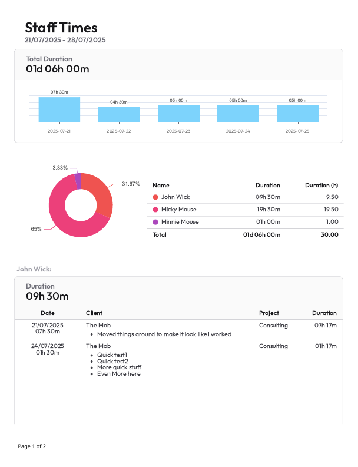
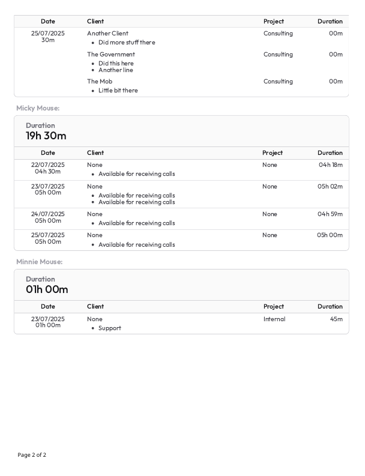

# [SolidTime](https://github.com/solidtime-io/solidtime) Standalone Report Generator

Provides a method of generating reports using templates outside of the
excellent [SolidTime Open-Source Time Tracker](https://github.com/solidtime-io/solidtime).

## Quick Start

- Create a config.yml with the following format:

```yaml
defaults:
# Optionally specify your organization ID below to save
# having to type it in every time.
#
#organization: c978f137-d5ac-4c33-87b8-df34fb4718fb

# Details to reach PostGres database
db:
  host: <hostname>
  database: <database>
  username: <username>
  password: <password>

gotenberg:
  uri: http://<address.to.gotenberg>:3000
```

- Make sure the database is reachable. Also `gotenberg`.

- If you download this directly from github you need to make sure to create a python venv and to
  install all the dependancies in `requirements.txt`. Doing the following under Linux might work:

```shell
cd (folder where you see app)
python -m venv .venv            # Creates virtual environment
source .venv/bin/activate       # Enter virtual environemtn
pip install -r requirements.txt # Install dependencies
```

- Execute a report and specify date range. For example:

```shell
python app/report.py staff_times --start 2023-01-01 --end 2026-01-01 output.pdf 
```

Report will be saved to `output.pdf`

- Optionally a logo can be added by saving it in a file `logo.png` then adding `--add logo.png` to the command.
- Optionally you can also supply a `custom.css` to have it included in the template to override the styles without
  needing to edit the template.
- Add `--help` for other options like filtering by Project or changing templates.

## Why

There are an infinite number of ways of presenting data and no app will every be able to support
every possible option and for good reason. For this reason I decided to try make it easier for anyone
who wants to generate reports from SolidTime to be able to create their own reports.

Right now we just query the database directly which means this generator is only useful for those
who run the on-prem version of SolidTime. Perhaps pulling the data through the API will
allow support where the database is not directly reachable.

## Reports

The available reports are found under `reports`. This is the meaty bit of the
reports, written in python, that query the database and aggregate the data.

The following reports are available:

- `staff_times` - Generate a list of hours' staff have worked and show all the jobs they worked on.
  Descriptions of the same projects are merged per day. Time is added up each day then is rounded up to the nearest 30
  minutes unless it is within 15% (4.5 minutes) of the boundary in which case it rounds down unless it would round down
  to 0 in which case it rounds up. This emulates filling in a timesheet manually. The actual times are shown in the
  detail section on the right and the rounded times to the left under the dates as well as in the summary above.




## Templates

Each report will pass its data through one or more templates which can be found under `templates`. These are
[Jinja2](https://jinja.palletsprojects.com/en/stable/) and you can specify which template to use often by passing
`--template <templatename>` (it will add the .html automatically). This allows one to copy an existing template and
modify it for their need's then run it through the same report.

There are some filters which can be found under `filters` and can be used in the template. The filters are:

- `format_time` Formats time in seconds to a string of the format 'xxd xxh xxm', for example '02d 12h 10m'.
- `format_hours` Formats time in seconds into hours. Example: `6.09`
- `pick_color` Takes a number input and returns a css color from a list. Example `0` will return `#ef5350`

In the template you can use a filter by passing it as `|filter`. For example: `Duration: {{ my_hours|format_time }}`

## Contributing

Feel free to provide PR's, especially for reports and templates. You may have an idea of presenting data that
is unique and of interest to someone else.

The following would be useful:

- More Reports
- More Templates for existing reports
- Localization
- Documentation (how to write a report/template for
  example). [mkdocs-material](https://github.com/squidfunk/mkdocs-material) is what
  I normally like and can be published via github action to pages.
- Github actions to build a docker image. Advantage of this is we don't need to make db and gotenberg visible.