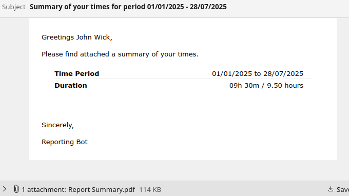

# [SolidTime](https://github.com/solidtime-io/solidtime) Standalone Report Generator

Provides a method of generating reports using templates outside of the
excellent [SolidTime Open-Source Time Tracker](https://github.com/solidtime-io/solidtime).

## Quick Start

1. Download and build Docker image

```shell
git clone https://github.com/bundabrg/solidreport.git
docker build solidreport -t solidreport
```

2. Check what network your existing Solidtime uses. It might be called `docker_interal` or `solidtime_internal`

```shell
docker network ps
```

3. Make a folder `sr-data` and create a `config.yml` file inside with the following

```yaml
defaults:
# Optionally specify your organization ID below to save
# having to type it in every time.
#
#organization_id: c978f137-d5ac-4c33-87b8-df34fb4718fb

# Details to reach PostGres database
db:
  host: database
  database: solidtime
  username: solidtime
  password: <db password>

gotenberg:
  uri: http://gotenberg:3000
```

4. Generate a report and specify a date range. For example:

```shell
docker run -it  \
   --network=solidtime_internal \
   -v ./sr-data:/sr-data \
   solidreport generate staff_times --start <start-date> --end <end-date>
```

Report will be saved to `output.pdf` in the `sr-data` folder

- Optionally a logo can be added by saving it in a file `logo.png` inside `sr-data` then adding `--resource logo.png` to
  the command.
- Optionally you can also supply a `custom.css` inside `sr-data` to have it included in the template to override the
  styles without
  needing to edit the template. Remember to add `--resource customcss`.
- Add `--help` for other options like filtering by Project or changing templates.

## Why

There are an infinite number of ways of presenting data and no app will every be able to support
every possible option and for good reason. For this reason I decided to try make it easier for anyone
who wants to generate reports from SolidTime to be able to create their own reports.

Right now we just query the database directly which means this generator is only useful for those
who run the on-prem version of SolidTime. Perhaps pulling the data through the API will
allow support where the database is not directly reachable.

## Reports

The available reports are found under `reports`. This is the meaty bit of the
reports, written in python, that query the database and aggregate the data.

The following reports are available:

- `staff_times` - Generate a list of hours' staff have worked and show all the jobs they worked on.
  Descriptions of the same projects are merged per day. Time is added up each day then is rounded up to the nearest 30
  minutes unless it is within 15% (4.5 minutes) of the boundary in which case it rounds down unless it would round down
  to 0 in which case it rounds up. This emulates filling in a timesheet manually. The actual times are shown in the
  detail section on the right and the rounded times to the left under the dates as well as in the summary above.


- `client_times` - Generate a summary of times in the period for a specific client along with any charges. The same
  rounding rules above apply. A client can be specified using its id with `--client-id` or its name via `client-filter`.

## Templates

Each report will pass its data through one or more templates which can be found under `templates/html`. These are
[Jinja2](https://jinja.palletsprojects.com/en/stable/) and you can specify which template to use often by passing
`--template <templatename>` (it will add the .html automatically). This allows one to copy an existing template and
modify it for their need's then run it through the same report.

Each report may have multiple templates. For example `staff_times` has two templates. One that summarizes time broken
down by member (good to send to your accounts to have a summary of staff timesheets) and the breaks it down by
project and is good for when filtering by a member and sending them their own timesheets. See [](#actions) below where
we use this.

There are some filters that can be found under `filters` and can be used in the template. The filters are:

- `format_time` Formats time in seconds to a string of the format 'xxd xxh xxm', for example '02d 12h 10m'.
- `format_hours` Formats time in seconds into hours. Example: `6.09`
- `pick_color` Takes a number input and returns a css color from a list. Example `0` will return `#ef5350`
- `format_currency` Converts cents into properly formatted dollars.

In the template you can use a filter by passing it as `|filter`. For example: `Duration: {{ my_hours|format_time }}`

## Actions

Instead of just generating reports you can instead configure `actions`. This allows you to create one or more steps
that execute some code that does something. These can be found under `actions`.

You might want to email a summary of everyone's times to accounts and also send to each staff their own times. This can
be defined as a 2 step action by adding the following to `config.yml`

```yaml
actions:
  summary_to_accounts:
    - description: Send a summary to Accounts
      action: send_staff_times_summary
      defaults:
        organization_id: ab08c709-4d3d-4d47-8ae1-b92998486b7c
        resource:
          - logo.png
          - custom.css
      subject: Summary of times for period {start} - {end}
      email_logo: logo.png
      recipients:
        - name: Accounts Dept
          email: accounts@example.org
    - description: Send staff their own times
      action: send_staff_times_individual
      defaults:
        organization_id: ab08c709-4d3d-4d47-8ae1-b92998486b7c
        resource:
          - logo.png
          - custom.css
      subject: Summary of your times for period {start} - {end}
      email_logo: logo.png
      #force_recipient: test@example.org
```

This creates an `action group` called `summary_to_accounts` which calls the actions `send_staff_times_summary` and
`send_staff_times_individual`.

You'll also need to add some email settings to `config.yml` in the following format:

```yaml
email:
  host: <hostname>>
  port: 587
  username: <username>>
  password: <password>
  from_name: <Friendly From Name>>
  from_email: <From Email>
```

Now to execute the action:

```shell
python app/report.py action summary_to_accounts --var start=2025-01-01 --var end=2025-02-01
```

This will build an email using a template in a Jinjafied [mjml format](mjml.io) located in `templates/email`.



Presently the following actions are available:

### send_staff_times_summary

- Will execute the report `staff_times` and then email it to each recipient.

```yaml
description: Description of the Action being taken
action: send_staff_times_summary
subject: Email Subject. Can include {start}, {end}
email_logo: Logo to use in the email.
recipients:
  - name: Name of person to get report
    email: Email of person to get report
```

### send_staff_times_individual

- Will lookup any members with time in the specified period, then for each one it will
  execute the `staff_times` report filtering for that user and use the template `staff_times_individual.html`. It will
  then send the report to the member (unless force_recipient is set in which case it will send to that address).

```yaml
description: Description of the Action being taken
action: send_staff_times_individual
subject: Email Subject. Can include {start}, {end}, {user_name}
email_logo: Logo to use in the email.
force_recipient: Send mail to this email instead of to the users own email
```

### send_client_times

- Will lookup any clients with time in the specified period, then for each one it will execute
  the `client_times` report filtering for that client. It will then send the report to all the recipients specified in
  the action key `recipients`

```yaml
description: Description of the Action being taken
action: send_client_times
subject: Email Subject. Can include {start}, {end}, {client_name}
email_logo: Logo to use in the email.
recipients:
  - name: Name of person to get report
    email: Email of person to get report
```

## Building Manually

To build the project do the following:

1. Create a python .venv and activate it

```shell
python3 -m venv .venv
source .venv/bin/activate
```

2. Install dependencies

```shell
pip install -r requirements.txt
```

3. Execute it

```shell
python app/report.py --help
```

## Contributing

Feel free to provide PR's, especially for reports and templates. You may have an idea of presenting data that
is unique and of interest to someone else.

The following would be useful:

- More Reports
- More Templates for existing reports
- Useful actions
- Localization
- Documentation (how to write a report/template for
  example). [mkdocs-material](https://github.com/squidfunk/mkdocs-material) is what I normally like and can be published
  via github action to pages.
- Github actions to build a docker image. Advantage of this is we don't need to make db and gotenberg visible.